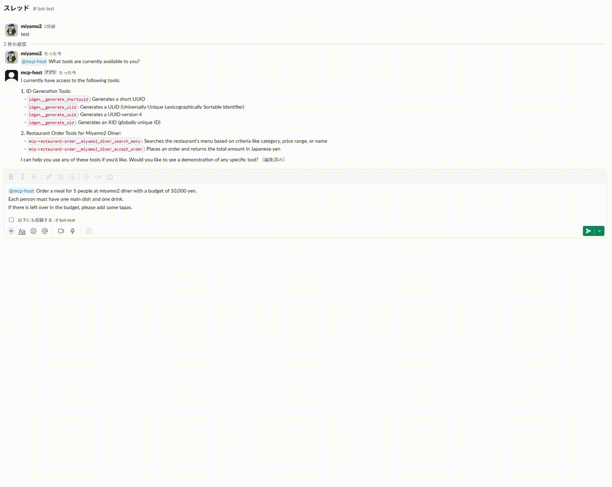

# slackbot-mcp-host

MCP Host as a Slack Bot

## Demo



## Features

### Supported MCP Servers

- [x] stdio
  - [x] executable file (Must be installed by bundle feature)
- [ ] sse

### Bundle MCP Servers

'slackbot-mcp-host' able to bundle MCP server with Docker image at compile time.

- [x] go
- [ ] npm
- [x] uv
- [x] bun

```json
{
  "mcpServers": {...},
  "bundle": {
    "go": {
      "packages": [
        "github.com/miyamo2/mcp-restaurant-order@latest"
      ]
    },
    "uv": {
      "packages": [
        "mcp-server-fetch"
      ]
    },
    "bun": {
      "packages": [
        "@modelcontextprotocol/server-brave-search@latest"
      ]
    }
  }
}
```

## Setup

### Create a Slack App

See: https://api.slack.com/quickstart

### GCP

#### Login to GCP

```sh
gcloud auth application-default login
```

#### Create a new project

```sh
gcloud projects create <PROJECT_ID>
gcloud config set project <PROJECT_ID>
```

#### Enable billing

##### See available billing account

```sh
gcloud billing accounts list
# output
ACCOUNT_ID: <BILLING_ACCOUNT_ID>
NAME: <BILLING_ACCOUNT_NAME>
OPEN: <TRUE|FALSE>
MASTER_ACCOUNT_ID: <MASTER_ACCOUNT_ID>
```

##### Link billing account to the project

```sh
gcloud alpha billing projects link <PROJECT_ID> --billing-account="<BILLING_ACCOUNT_ID>"
```

#### Enable api

```sh
gcloud services enable iam.googleapis.com run.googleapis.com artifactregistry.googleapis.com 
```

### Terraform

#### Edit terraform variables

```json5
{
  "mcpServers": {
    "mcp-restaurant-order": {
      "command": "mcp-restaurant-order"
    },
    "fetch": {
      "command": "mcp-server-fetch"
    },
    "server-brave-search": {
      "command": "mcp-server-brave-search",
      "env": {
        "BRAVE_API_KEY": "<BraveApiKey>",
      }
    }
  },                                           # (Required) MCP servers to connect to.,
  "bundle": {
    "go": {
      "packages": [
        "github.com/miyamo2/mcp-restaurant-order@latest"
      ]
    },
    "uv": {
      "packages": [
        "mcp-server-fetch"
      ]
    },
    "bun": {
      "packages": [
        "@modelcontextprotocol/server-brave-search@latest"
      ]
    }
  },                                           # (Optional) MCP servers to install at compile time. Supported: go, uv, bun
  "llmProviderName": "anthropic",              # (Required) anthropic | openai | google
  "llmApiKey": "<LLMApiKey>",                  # (Optional) Model to be used
  "llmModelName": "<LLMModelName>",            # (Optional) API Key for LLM Provider
  "slackBotToken": "<SlackBotToken>",          # (Required) Slack bot token. 'app_mentions:read', 'chat:write' and 'users:read' scopes are required.
  "slackSigninSecret": "<SlackSigninSecret>",  # (Required) Slack Signin Secret
  "allowedUsers": [
    "<UserID1>"
  ],                                           # (Optional) List of user IDs who can use the bot
  "gcpProjectId": "<GCPProjectId>",            # (Required) GCP project ID
  "gcpProjectNumber": "<GCPProjectNumber>",    # (Required) GCP project number
  "gcpRegion": "<GCPRegion>"                   # (Required) GCP region
}
```

#### terraform apply

```sh
cd .deploy
terraform init
terraform plan -var-file tfvars.json
terraform apply -var-file tfvars.json
```

## Related Repositories

https://github.com/sooperset/mcp-client-slackbot

https://github.com/mark3labs/mcphost
